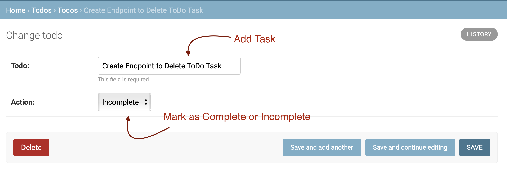
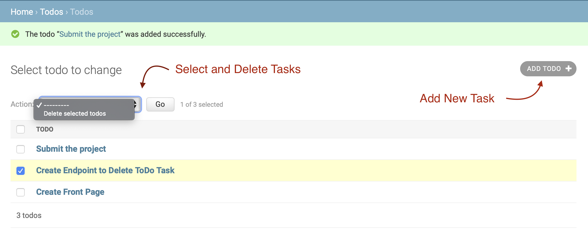

# Python RESTful API

Here we develop a Django based RESTful API which implements a ToDo Application.

It has various endpoints, one to create a ToDo task, other to mark the task as complete or incomplete and last endpoint to delete the ToDo task.

Following are the dependencies to build and execute the application.

Install and activate the virtual environment before you execute any of the files. Make sure thet the dependencies are installed in venv. [Guide to install virtual environment](https://packaging.python.org/guides/installing-using-pip-and-virtual-environments/)

### Framework : Django
> pip install Django

### Database : Sqlite
No need to install it externally as it comes with Django

### Python
> 3.6.4

To execute the files, navigate to the folder and run the following commands

Using the following command, you create your login information by entering username and password for authentication.

> python3 manage.py createsuperuser

OR

>python manage.py createsuperuser

By executing the next command, the server is fired up
> python3 manage.py runserver

OR

>python manage.py runserver

Keep the server running and in your browser, copy *127.0.0.1:8000/admin* to see the application running. Enter the username and password created in the previous step and you can start adding tasks to the ToDo List.

### Adding task to ToDo List and change action

### Delete Tasks from ToDo List

