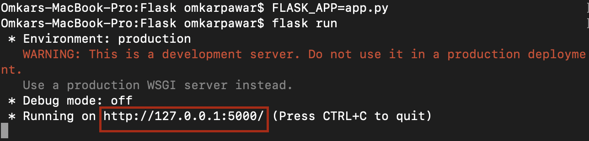
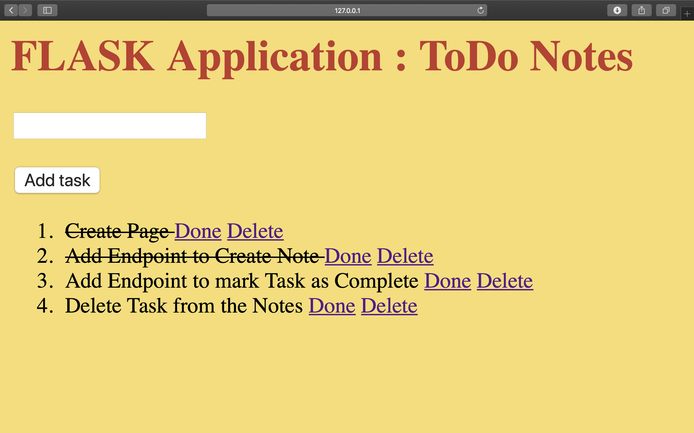

# Python RESTful API

Here we develop a Flask based RESTful API which implements a ToDo Application.

It has 3 endpoints, one to create a ToDo task, other to mark the task as complete or incomplete and last endpoint to delete the ToDo task.

Following are the dependencies to build and execute the application.  

Install and activate the virtual environment before you execute any of the files. Make sure thet the dependencies are installed in venv. [Guide to install virtual environment](https://packaging.python.org/guides/installing-using-pip-and-virtual-environments/)

### Framework : Flask and HTML
> pip install Flask

### Database : SQLAlchemy
>pip install Flask-SQLAlchemy

### Python
> 3.6.4

As I'm using Python3, I don't have to install virtual environment modules explicitly.

To execute the files, run the following commands

> ##### export FLASK_APP=app.py

> ##### flask run

Open the link into your browser to see the application functioning.

To add a todo task, we enter the task name into the field. Flask Script takes this as an argument, adds the task to database with default as not complete and shows the task into our todo list on the same page.

If the task is to be marked as done, we simply click the "Done" button ahead of the task to mark it as complete and strike it off. To delete the task from out notes, just click "Delete" and the record is removed from the database.

